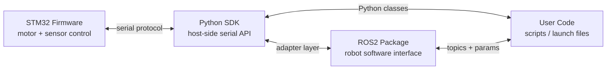

# API Reference

Goal: define the first public interface contract between firmware, Python SDK, and ROS2 integration for the ROS2-Compatible STM32 Robot Controller Kit.

> Validation status: draft API. The command names, frame format, baud rate, message fields, and ROS2 package names must be verified after firmware, SDK, and hardware bring-up.

## System Boundary



## Version Policy

Firmware, SDK, and ROS2 package versions should move together.

```text
Firmware 0.1.x <-> Python SDK 0.1.x <-> ROS2 package 0.1.x
Firmware 0.2.x <-> Python SDK 0.2.x <-> ROS2 package 0.2.x
```

Host tools should query firmware version before sending motion commands.

## Serial Link

Draft defaults:

| Field | Draft Value |
| --- | --- |
| Transport | USB CDC serial or USB-UART |
| Baud rate | 115200 |
| Data bits | 8 |
| Parity | None |
| Stop bits | 1 |
| Flow control | None |
| Command timeout | 500 ms |

Open decisions:

- [ ] ASCII command protocol or binary framed protocol
- [ ] CRC or checksum
- [ ] Maximum frame length
- [ ] Telemetry publish rate

## Firmware Command Set

### `PING`

Purpose: verify that the board is connected and responsive.

Request:

```text
PING
```

Response:

```text
ACK PING
```

### `GET_VERSION`

Purpose: return firmware and protocol version.

Request:

```text
GET_VERSION
```

Response:

```text
VERSION firmware=0.1.0 protocol=0.1 board=stm32_robot_controller
```

### `GET_STATUS`

Purpose: return board state and current error.

Request:

```text
GET_STATUS
```

Response:

```text
STATUS state=IDLE error=ERR_OK uptime_ms=12345 motor_fault=0 imu_ready=1 encoder_ready=1
```

### `SET_MOTOR`

Purpose: command left and right motor speed.

Request:

```text
SET_MOTOR left=<float> right=<float>
```

Draft range:

```text
-1.0 <= speed <= 1.0
```

Example:

```text
SET_MOTOR left=0.30 right=0.30
```

Response:

```text
ACK SET_MOTOR
```

Safety behavior:

- Values outside the allowed range must be rejected or clamped.
- Motors must stop if command timeout expires.
- Motors must stop on firmware fault.

### `STOP`

Purpose: immediately stop motor output.

Request:

```text
STOP
```

Response:

```text
ACK STOP
```

### `READ_IMU`

Purpose: read one IMU sample.

Request:

```text
READ_IMU
```

Response:

```text
IMU ax=0.00 ay=0.00 az=9.80 gx=0.00 gy=0.00 gz=0.00
```

Units:

| Field | Unit |
| --- | --- |
| `ax`, `ay`, `az` | m/s^2 |
| `gx`, `gy`, `gz` | rad/s |

### `READ_ENCODER`

Purpose: read wheel encoder counts.

Request:

```text
READ_ENCODER
```

Response:

```text
ENCODER left=1234 right=1230
```

## Error Model

Firmware errors should be stable across firmware, SDK, ROS2 diagnostics, troubleshooting docs, and support replies.

| Code | Name | Meaning |
| --- | --- | --- |
| `0x0000` | `ERR_OK` | No error |
| `0x0001` | `ERR_BAD_COMMAND` | Unknown or malformed command |
| `0x0002` | `ERR_BAD_ARGUMENT` | Argument out of range |
| `0x0003` | `ERR_COMMAND_TIMEOUT` | Host command timeout |
| `0x0100` | `ERR_MOTOR_FAULT` | Motor driver fault |
| `0x0200` | `ERR_IMU_NOT_READY` | IMU init or read failed |
| `0x0300` | `ERR_ENCODER_FAULT` | Encoder read problem |
| `0x0400` | `ERR_PROTOCOL_CRC` | Protocol checksum failed |

Example error response:

```text
ERROR code=0x0002 name=ERR_BAD_ARGUMENT message="left speed out of range"
```

## Python SDK Draft

Package name draft:

```text
robot_controller
```

Main class:

```python
from robot_controller import RobotController

board = RobotController("/dev/ttyUSB0")
print(board.get_version())
board.set_motor_speed(0.2, 0.2)
print(board.read_imu())
print(board.read_encoder())
board.stop()
board.close()
```

### `RobotController(port, baudrate=115200, timeout=1.0)`

Opens a serial connection to the board.

Arguments:

| Argument | Type | Description |
| --- | --- | --- |
| `port` | `str` | Serial port path, such as `/dev/ttyUSB0` or `COM3` |
| `baudrate` | `int` | Serial baud rate |
| `timeout` | `float` | Read timeout in seconds |

### `get_version()`

Returns firmware and protocol version information.

Draft return shape:

```python
{
    "firmware": "0.1.0",
    "protocol": "0.1",
    "board": "stm32_robot_controller",
}
```

### `get_status()`

Returns board state and diagnostics.

Draft return shape:

```python
{
    "state": "IDLE",
    "error": "ERR_OK",
    "uptime_ms": 12345,
    "motor_fault": False,
    "imu_ready": True,
    "encoder_ready": True,
}
```

### `set_motor_speed(left, right)`

Sends a left and right speed command.

Range:

```text
-1.0 <= left <= 1.0
-1.0 <= right <= 1.0
```

### `stop()`

Stops all motor output.

### `read_imu()`

Returns one IMU sample.

Draft return shape:

```python
{
    "ax": 0.0,
    "ay": 0.0,
    "az": 9.8,
    "gx": 0.0,
    "gy": 0.0,
    "gz": 0.0,
}
```

### `read_encoder()`

Returns encoder counts.

Draft return shape:

```python
{
    "left": 1234,
    "right": 1230,
}
```

## Python Exceptions

Draft exception hierarchy:

```text
RobotControllerError
  ConnectionError
  ProtocolError
  FirmwareError
  TimeoutError
  VersionMismatchError
```

Why this matters:

- User scripts can handle board errors cleanly.
- ROS2 nodes can convert exceptions into diagnostics.
- Troubleshooting docs can map exceptions to fixes.

## ROS2 Interface Draft

Package name draft:

```text
robot_controller
```

### Topics

| Topic | Type | Direction | Purpose |
| --- | --- | --- | --- |
| `/wheel_cmd` | `geometry_msgs/msg/Twist` | host to node | Command robot motion |
| `/imu/data` | `sensor_msgs/msg/Imu` | node to host | Publish IMU data |
| `/encoder` | draft custom msg or `std_msgs/msg/Int32MultiArray` | node to host | Publish encoder counts |
| `/diagnostics` | `diagnostic_msgs/msg/DiagnosticArray` | node to host | Publish board health |

### Parameters

| Parameter | Type | Default | Purpose |
| --- | --- | --- | --- |
| `port` | `string` | `/dev/ttyUSB0` | Serial device |
| `baudrate` | `int` | `115200` | Serial speed |
| `frame_id` | `string` | `imu_link` | IMU frame |
| `publish_rate_hz` | `double` | `50.0` | Sensor publish rate |
| `command_timeout_ms` | `int` | `500` | Motor command timeout |

Launch draft:

```bash
ros2 launch robot_controller demo.launch.py port:=/dev/ttyUSB0
```

### Node Behavior

The ROS2 node should:

- Query firmware version at startup.
- Refuse motion commands if firmware version is incompatible.
- Publish diagnostics if the board reports a fault.
- Stop motors on shutdown.
- Stop motors when command timeout expires.

## Compatibility Checklist

- [ ] Firmware responds to `PING`
- [ ] Firmware exposes version
- [ ] Python SDK validates version
- [ ] Python SDK maps firmware errors to exceptions
- [ ] ROS2 node exposes serial port parameter
- [ ] ROS2 node publishes diagnostics
- [ ] Motor commands stop on timeout
- [ ] API examples match Quick Start

## Draft Gaps

- [ ] Confirm protocol frame format
- [ ] Confirm default baud rate
- [ ] Confirm encoder message type
- [ ] Confirm ROS2 package name
- [ ] Confirm Python package name
- [ ] Add real terminal logs
- [ ] Add generated API docs after SDK implementation

