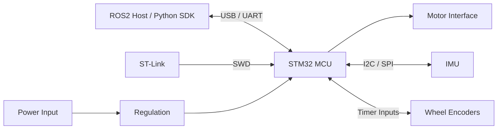

# Datasheet

Product: ROS2-Compatible STM32 Robot Controller Kit

> Validation status: draft datasheet. Electrical values, pinout, dimensions, current ratings, and ordering information must be confirmed after schematic, PCB, and hardware testing.

## Overview

The ROS2-Compatible STM32 Robot Controller Kit is a developer kit for mobile robot prototyping and education. It is designed to connect low-level robot hardware, such as motors, IMU modules, and wheel encoders, to host-side software through firmware, a Python SDK, and ROS2 examples.

This is not a certified consumer appliance. It is intended for safe lab use by developers, students, makers, and robotics educators.

## Features

- STM32-based embedded controller target
- Host communication over USB serial or UART target
- Motor control interface target
- IMU interface over I2C or SPI target
- Wheel encoder input target
- SWD programming and debugging target
- Python SDK examples target
- ROS2 package examples target
- Open-source documentation and test flow target

## Applications

- Mobile robot prototyping
- ROS2 learning projects
- Robotics classroom labs
- Embedded systems education
- Motor and sensor integration demos
- Maker and hacker hardware experiments

## Block Diagram



## Pinout

Draft connector groups:

| Group | Signals | Status |
| --- | --- | --- |
| Power input | VIN, GND | To be confirmed |
| SWD | SWDIO, SWCLK, NRST, VTREF, GND | To be confirmed |
| Host serial | TX, RX, GND, optional 5V or 3V3 | To be confirmed |
| Motor 1 | PWM, DIR, EN, FAULT | To be confirmed |
| Motor 2 | PWM, DIR, EN, FAULT | To be confirmed |
| Encoder left | A, B, VCC, GND | To be confirmed |
| Encoder right | A, B, VCC, GND | To be confirmed |
| IMU | SDA/SCL or SCK/MISO/MOSI/CS | To be confirmed |
| Expansion | UART, I2C, SPI, GPIO, 3V3, GND | To be confirmed |

## Electrical Characteristics

Draft table:

| Parameter | Min | Typical | Max | Unit | Notes |
| --- | --- | --- | --- | --- | --- |
| Logic voltage | TBD | 3.3 | TBD | V | Confirm after regulator choice |
| Input voltage | TBD | TBD | TBD | V | Confirm after power design |
| Host serial voltage | TBD | 3.3 | TBD | V | Confirm 5 V tolerance before claiming |
| Motor interface voltage | TBD | TBD | TBD | V | Depends on driver architecture |
| Encoder input voltage | TBD | TBD | TBD | V | Confirm level shifting |
| Operating temperature | TBD | TBD | TBD | C | Not certified yet |

Do not use unverified electrical limits for purchasing, classroom safety, or production deployment.

## Communication Protocol

The first protocol draft is documented in [api_reference.md](api_reference.md).

Draft commands:

- `PING`
- `GET_VERSION`
- `GET_STATUS`
- `SET_MOTOR`
- `STOP`
- `READ_IMU`
- `READ_ENCODER`

Draft host tools:

- Python SDK package: `robot_controller`
- ROS2 package: `robot_controller`

## Mechanical Dimensions

Status: not confirmed.

To be added after PCB layout:

- Board length
- Board width
- Mounting hole diameter
- Mounting hole spacing
- Connector keep-out zones
- Enclosure notes

## Environmental And Safety Notes

- Use in a safe lab environment.
- Keep wheels lifted during first motor tests.
- Avoid short circuits and loose wires.
- Use current-limited power for early bring-up.
- Do not claim CE, FCC, or other certification until completed.

## Ordering Information

Draft product title:

```text
ROS2-Compatible STM32 Robot Controller Kit for Mobile Robot Prototyping
```

Draft kit contents:

- 1x robot controller board
- 1x cable set
- 1x Quick Start link
- 1x GitHub repository access
- 1x example firmware
- 1x Python SDK
- 1x ROS2 demo package

Ordering is not open yet. First public sales target is small-batch developer kits after hardware validation, firmware tests, documentation, pricing, and fulfillment planning.

## Revision History

| Revision | Date | Notes |
| --- | --- | --- |
| 0.1 draft | 2026-06-26 | Initial datasheet structure |

## Draft Gaps

- [ ] Confirm MCU part number
- [ ] Confirm schematic
- [ ] Confirm PCB dimensions
- [ ] Confirm input voltage range
- [ ] Confirm motor interface rating
- [ ] Confirm connector pinout
- [ ] Add real photos and diagrams
- [ ] Add verified ordering information

