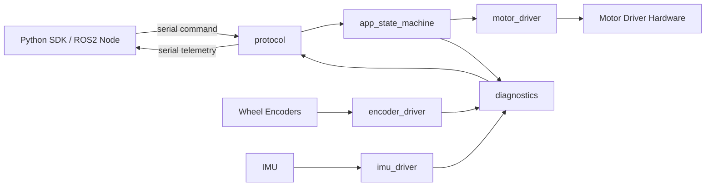

# Firmware Overview

Goal: define the first product-oriented firmware architecture for the ROS2-Compatible STM32 Robot Controller Kit before writing the full implementation.

> Validation status: architecture draft. Exact MCU peripherals, pin mapping, RTOS choice, protocol frame format, and timing values must be confirmed during firmware bring-up.

## Firmware Role

The firmware is the real-time layer between the ROS2 host computer and the robot hardware.

It should:

- Drive motors with predictable timing.
- Read IMU and encoder data.
- Protect the board from unsafe command states.
- Report firmware version, errors, and diagnostics.
- Expose a stable serial protocol for the Python SDK and ROS2 package.

It should not:

- Run high-level navigation.
- Depend on ROS2 directly.
- Hide hardware faults from the host.
- Mix demo logic with low-level drivers.

## Target Firmware Layers

```text
firmware/
  BSP/
    board_pins.h
    board_config.h
  Drivers/
    motor_driver.c
    motor_driver.h
    imu_driver.c
    imu_driver.h
    encoder_driver.c
    encoder_driver.h
  App/
    app_state_machine.c
    app_state_machine.h
    protocol.c
    protocol.h
    diagnostics.c
    diagnostics.h
  Config/
    firmware_config.h
    version.h
    error_code.h
  Core/
    main.c
```

Why this structure:

- `BSP` keeps board-specific pins and hardware choices in one place.
- `Drivers` owns low-level hardware behavior.
- `App` owns product behavior and host communication.
- `Config` owns versions, error codes, and compile-time settings.
- `Core` stays thin so the project does not become a single giant `main.c`.

## Data Flow



## Module Responsibilities

### `board_pins`

Purpose:

- Map logical firmware names to real MCU pins.
- Make board revisions easier to support.

Examples:

```c
#define MOTOR_LEFT_PWM_PORT   GPIOA
#define MOTOR_LEFT_PWM_PIN    GPIO_PIN_0
#define IMU_I2C_HANDLE        hi2c1
```

Rules:

- No control logic in pin files.
- No protocol logic in pin files.
- Board revision changes should mostly touch BSP files.

### `motor_driver`

Purpose:

- Convert signed speed commands into safe motor driver signals.
- Own PWM, direction, enable, brake, and fault handling.

Target API:

```c
void motor_driver_init(void);
void motor_driver_set_speed(float left, float right);
void motor_driver_stop(void);
bool motor_driver_has_fault(void);
```

Safety rules:

- Clamp speed commands to the allowed range.
- Default to stopped after boot.
- Stop motors when the command timeout expires.
- Stop motors when a driver fault is detected.

### `imu_driver`

Purpose:

- Initialize the IMU.
- Read accelerometer and gyro data.
- Report sensor health.

Target API:

```c
bool imu_driver_init(void);
bool imu_driver_read(imu_sample_t *sample);
bool imu_driver_is_ready(void);
```

Open decisions:

- [ ] Default IMU part
- [ ] I2C or SPI first
- [ ] Sample rate
- [ ] Calibration strategy

### `encoder_driver`

Purpose:

- Count wheel encoder ticks.
- Provide velocity or delta counts for odometry experiments.

Target API:

```c
void encoder_driver_init(void);
int32_t encoder_driver_get_left_count(void);
int32_t encoder_driver_get_right_count(void);
void encoder_driver_reset(void);
```

Open decisions:

- [ ] Timer capture mode
- [ ] Encoder resolution
- [ ] 3.3 V only or 5 V tolerant input path
- [ ] Overflow handling

### `protocol`

Purpose:

- Parse host commands.
- Encode firmware responses.
- Keep Python SDK and ROS2 integration stable.

First command set:

| Command | Direction | Purpose |
| --- | --- | --- |
| `PING` | host to board | Check connection |
| `GET_VERSION` | host to board | Read firmware version |
| `SET_MOTOR` | host to board | Set left and right motor speed |
| `STOP` | host to board | Stop all motion |
| `READ_IMU` | host to board | Request IMU sample |
| `READ_ENCODER` | host to board | Request encoder counts |
| `GET_STATUS` | host to board | Read error and diagnostic state |

First telemetry set:

| Message | Direction | Purpose |
| --- | --- | --- |
| `ACK` | board to host | Command accepted |
| `ERROR` | board to host | Command failed |
| `VERSION` | board to host | Firmware version |
| `IMU` | board to host | IMU sample |
| `ENCODER` | board to host | Encoder counts |
| `STATUS` | board to host | State and errors |

Open decisions:

- [ ] ASCII command protocol or binary framed protocol
- [ ] Default baud rate
- [ ] Checksum or CRC
- [ ] Message timeout

### `app_state_machine`

Purpose:

- Own product-level behavior.
- Keep the robot in safe states.
- Coordinate commands, sensors, and diagnostics.

Initial states:

```text
BOOT
IDLE
ARMED
RUNNING
FAULT
```

Basic transitions:

```text
BOOT -> IDLE after firmware init succeeds
IDLE -> ARMED after host connection check
ARMED -> RUNNING after valid motor command
RUNNING -> IDLE after stop command
ANY -> FAULT after unsafe error
FAULT -> IDLE after clear fault command and safe checks
```

Safety behavior:

- Motors start stopped.
- Motors stop when serial commands time out.
- Motors stop when firmware enters `FAULT`.
- Host must explicitly send a new command after a fault clears.

### `diagnostics`

Purpose:

- Track firmware health.
- Report useful debug information to users.

Target fields:

```text
firmware_version
uptime_ms
state
last_error
motor_fault
imu_ready
encoder_ready
command_timeout_count
```

## Error Codes

Error codes should be stable because they will appear in firmware logs, Python SDK exceptions, ROS2 diagnostics, troubleshooting docs, and customer support messages.

Initial error code draft:

| Code | Name | Meaning |
| --- | --- | --- |
| `0x0000` | `ERR_OK` | No error |
| `0x0001` | `ERR_BAD_COMMAND` | Unknown or malformed command |
| `0x0002` | `ERR_BAD_ARGUMENT` | Command argument out of range |
| `0x0003` | `ERR_COMMAND_TIMEOUT` | Host command timeout |
| `0x0100` | `ERR_MOTOR_FAULT` | Motor driver fault |
| `0x0200` | `ERR_IMU_NOT_READY` | IMU init or read failed |
| `0x0300` | `ERR_ENCODER_FAULT` | Encoder read problem |
| `0x0400` | `ERR_PROTOCOL_CRC` | Protocol checksum failed |

## Versioning

The firmware should expose a version string that the SDK and ROS2 package can check.

Target file:

```text
firmware/Config/version.h
```

Target format:

```c
#define FIRMWARE_VERSION_MAJOR 0
#define FIRMWARE_VERSION_MINOR 1
#define FIRMWARE_VERSION_PATCH 0
#define FIRMWARE_VERSION_STRING "0.1.0"
```

Why this matters:

- The SDK can warn users when firmware and host tools do not match.
- Troubleshooting becomes easier because logs include a version.
- Releases can connect firmware behavior to GitHub tags.

## Timing Targets

Draft targets:

| Task | Target Rate |
| --- | --- |
| Motor command update | 50 to 100 Hz |
| Command timeout check | 20 to 50 Hz |
| IMU sample | 50 to 100 Hz |
| Encoder update | Hardware timer based |
| Telemetry publish | 10 to 50 Hz |
| Diagnostics heartbeat | 1 Hz |

Open decisions:

- [ ] Bare-metal loop or RTOS
- [ ] Timer interrupt plan
- [ ] Serial RX buffering plan
- [ ] Telemetry rate limits

## Bring-Up Order

Do not start with every feature at once.

Recommended order:

1. Build an empty firmware project.
2. Blink status LED.
3. Print firmware version over serial.
4. Parse `PING`.
5. Parse `GET_VERSION`.
6. Add `STOP`.
7. Add safe motor command with wheels lifted.
8. Add IMU init and read.
9. Add encoder count.
10. Add diagnostics heartbeat.
11. Connect Python SDK.
12. Connect ROS2 package.

## Test Plan

Minimum firmware tests before selling any board:

- [ ] Power-on smoke test
- [ ] Firmware flashing test
- [ ] Version query test
- [ ] Motor stop-on-boot test
- [ ] Motor command clamp test
- [ ] Command timeout stop test
- [ ] IMU read test
- [ ] Encoder count test
- [ ] Error code reporting test
- [ ] Python SDK smoke test
- [ ] ROS2 demo smoke test

## First Implementation Tasks

- [ ] Create `firmware/BSP`
- [ ] Create `firmware/Drivers`
- [ ] Create `firmware/App`
- [ ] Create `firmware/Config`
- [ ] Add `version.h`
- [ ] Add `error_code.h`
- [ ] Add `motor_driver` interface
- [ ] Add `imu_driver` interface
- [ ] Add `encoder_driver` interface
- [ ] Add `protocol` interface
- [ ] Add `app_state_machine` skeleton
- [ ] Add first build instructions

## Risk Notes

- Do not let the first firmware become a demo-only single file.
- Do not expose undocumented protocol behavior to the SDK.
- Do not allow motors to move after boot without an explicit host command.
- Do not hide firmware faults from the host.
- Do not sell boards before firmware flashing, motor stop, and command timeout behavior are tested.

