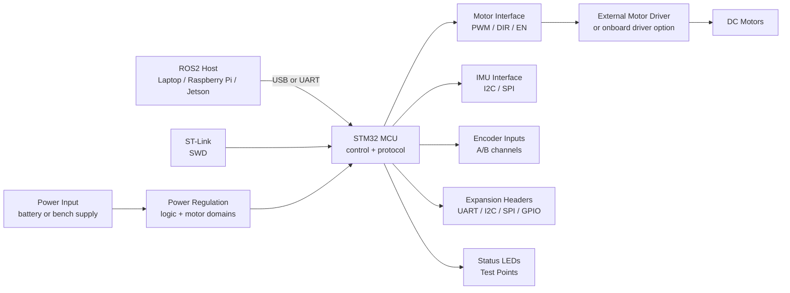

# Hardware Overview

Goal: describe the target hardware architecture for the ROS2-Compatible STM32 Robot Controller Kit before the schematic and PCB are finalized.

> Validation status: architecture draft. Exact MCU part number, connector pinout, voltage range, current rating, and board dimensions must be confirmed during schematic and PCB work.

## Product Role

The board is intended to sit between a host robot computer and low-level robot hardware.

Typical host computers:

- Laptop
- Raspberry Pi
- Jetson
- Mini PC running ROS2

Typical robot-side hardware:

- DC motors
- Motor drivers
- IMU
- Wheel encoders
- Battery or bench power supply
- Optional I2C, SPI, UART, or GPIO modules

## Target Architecture



## Hardware Blocks

### STM32 MCU

Purpose:

- Run real-time motor and sensor firmware.
- Expose a simple host protocol over USB or UART.
- Keep low-level timing separate from the ROS2 host computer.

Early requirements:

- Enough timers for motor PWM and encoder capture
- UART or USB device support for host communication
- I2C and SPI for sensors
- SWD for flashing and debug
- GPIO for enable pins, LEDs, and test points

Current prototype assumption:

```text
STM32F103C8T6 Blue Pill-compatible board
```

Reason:

- Lower first hardware cost than a Nucleo board.
- Easy to replace if a wiring or bring-up mistake damages the board.
- Good enough for early protocol, UART or USB CDC, GPIO, PWM, and simple sensor validation.

Constraints:

- Treat this as a bench prototype path, not the final product MCU decision.
- Flash, RAM, timer channels, USB behavior, and clone quality must be checked before promising a product spec.
- Use an ST-LINK/V2 compatible SWD programmer unless the selected board has a proven onboard/debug boot path.

Open decisions:

- [ ] Final STM32 family after C8T6 bench validation
- [ ] Final package
- [ ] Flash and RAM size
- [ ] USB native or USB-UART bridge

### Power Input And Regulation

Purpose:

- Accept robot power from a battery or bench supply.
- Provide stable logic power for the MCU and sensors.
- Keep motor noise from destabilizing the control logic.

Early requirements:

- Reverse-polarity protection target
- Input fuse or current limit target
- Clear separation between motor power and logic power
- Power indicator LED
- Test points for main rails

Open decisions:

- [ ] Input voltage range
- [ ] Logic rail voltage
- [ ] Motor current path rating
- [ ] Protection circuit choice

### Motor Interface

Purpose:

- Let firmware command motor speed and direction.
- Support common mobile robot differential-drive demos.

Target signals:

```text
Motor 1: PWM, DIR, EN, optional fault
Motor 2: PWM, DIR, EN, optional fault
```

Implementation options:

- External motor driver module interface for early prototypes
- Onboard motor driver for later product revisions

Open decisions:

- [ ] External driver first or onboard driver first
- [ ] Connector type
- [ ] Maximum supported motor voltage
- [ ] Maximum supported motor current

### Encoder Inputs

Purpose:

- Read wheel encoder signals for odometry experiments.

Target signals:

```text
Left encoder: A, B, VCC, GND
Right encoder: A, B, VCC, GND
```

Early requirements:

- Pull-up or level-shifting plan
- Timer capture support
- ESD and input protection target

Open decisions:

- [ ] 3.3 V only or 5 V tolerant input path
- [ ] Connector type
- [ ] Maximum encoder frequency

### IMU Interface

Purpose:

- Provide acceleration and gyro data for ROS2 demos.

Target options:

- I2C IMU module
- SPI IMU module
- Onboard IMU in a later board revision

Open decisions:

- [ ] Onboard IMU or external module first
- [ ] Default IMU part number
- [ ] I2C address or SPI chip select plan

### Host Communication

Purpose:

- Send motor commands from the host to the board.
- Return IMU, encoder, firmware version, and diagnostic data to the host.

Target options:

- USB CDC serial
- USB-UART bridge
- Direct UART header for embedded hosts

Early protocol goals:

- Human-readable debug logs
- Binary or framed serial protocol for SDK and ROS2 use
- Firmware version query
- Error code reporting

Open decisions:

- [ ] Default baud rate
- [ ] Protocol frame format
- [ ] USB connector type

### SWD And Debug

Purpose:

- Flash firmware.
- Debug early firmware and board bring-up.

Target signals:

```text
SWDIO
SWCLK
GND
VTREF
NRST
```

Early requirements:

- Standard 2.54 mm or compact SWD header
- Clearly labeled pins
- Accessible while the board is installed on a robot

### Expansion Headers

Purpose:

- Keep the board useful for experiments beyond the first demo.

Target buses:

- UART
- I2C
- SPI
- GPIO
- 3.3 V
- GND

Open decisions:

- [ ] Header pitch
- [ ] Pinout order
- [ ] 5 V pin availability
- [ ] Silk labels

## First Revision Scope

The first hardware revision should stay small and testable.

In scope:

- STM32 minimum system
- Power input and logic regulation
- SWD header
- Host serial or USB interface
- Motor driver interface
- IMU interface
- Encoder interface
- Status LED
- Test points

Out of scope for v0.1:

- Certification claims
- High-current motor driver promises before testing
- Waterproofing
- Production enclosure
- Mature industrial reliability claims

## Bring-Up Checklist

- [ ] Confirm board powers on without overheating
- [ ] Confirm logic rail voltage
- [ ] Flash firmware over SWD
- [ ] Blink status LED
- [ ] Print firmware version over serial
- [ ] Send one motor command with wheels lifted
- [ ] Read IMU sample
- [ ] Read encoder count
- [ ] Run Python smoke test
- [ ] Run ROS2 topic demo

## Hardware Evidence To Add

- [ ] Schematic PDF
- [ ] BOM CSV with MPNs
- [ ] PCB render
- [ ] Board top photo
- [ ] Board bottom photo
- [ ] Wiring photo
- [ ] First power-on test log
- [ ] Motor test video or GIF

## Risk Notes

- Do not claim CE or FCC certification before certification is complete.
- Do not sell untested boards as ready stock.
- Do not underestimate motor current, heat, ESD, short-circuit, or reverse-polarity risks.
- Do not promise shipping timelines before fulfillment is tested.
- Do not describe a lab demo as a mature industrial controller.

