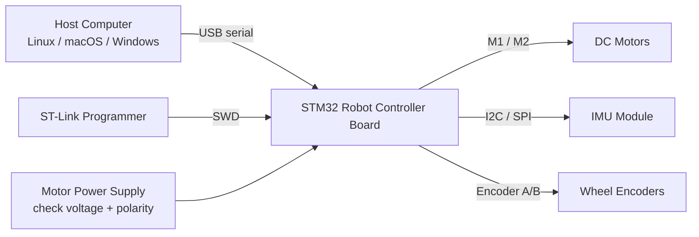

# Quick Start

Goal: run the first motor and sensor demo with the ROS2-Compatible STM32 Robot Controller Kit in about 10 minutes after the firmware, SDK, and ROS2 package are available.

> Validation status: draft flow. The exact board name, serial protocol, firmware target, and ROS2 package name will be verified after the first hardware and firmware build.

## What You Will Do

1. Connect the board, programmer, motor power, motors, and sensors.
2. Install the host-side tools.
3. Flash the STM32 firmware.
4. Run a Python smoke test.
5. Run a ROS2 demo.
6. Check expected output and common errors.

## Safety First

- Do not connect motor power before checking voltage and polarity.
- Do not let bare wires touch the board while powered.
- Use a current-limited bench supply for first tests when possible.
- Keep wheels lifted during the first motor test.
- This developer kit is for lab prototyping and education, not certified consumer use.

## 1. Hardware Connection

Minimum connection map:



Connection checklist:

- [ ] Connect the board to the host computer.
- [ ] Connect ST-Link to SWDIO, SWCLK, GND, and target voltage reference.
- [ ] Connect motor power, but keep the output disabled until firmware is flashed.
- [ ] Connect motors to the motor interface.
- [ ] Connect IMU and encoder signals if your demo uses them.
- [ ] Confirm the power LED turns on.

Expected serial device examples:

```text
Linux:   /dev/ttyUSB0 or /dev/ttyACM0
macOS:   /dev/tty.usbserial-* or /dev/tty.usbmodem-*
Windows: COM3 or similar
```

## 2. Install Host Tools

### Python

```bash
python --version
python -m pip install --upgrade pip
```

Target version:

```text
Python 3.10 or later
```

### Firmware Tools

Planned options:

- STM32CubeCLT or STM32CubeIDE
- GNU Arm Embedded Toolchain
- OpenOCD or STM32CubeProgrammer
- ST-Link driver

### ROS2

Recommended development environment:

```text
Ubuntu 22.04 + ROS2 Humble
```

Check ROS2:

```bash
ros2 --version
```

## 3. Flash Firmware

From the repository root:

```bash
cd firmware
make flash
```

Expected output:

```text
Building firmware...
Connecting to target...
Flashing firmware...
Verify OK
```

If the board cannot be flashed:

- Check ST-Link wiring.
- Check board power.
- Check boot mode.
- Check that no other program is using the programmer.
- Try a shorter USB cable.

## 4. Find The Serial Port

Linux:

```bash
ls /dev/ttyUSB* /dev/ttyACM*
```

macOS:

```bash
ls /dev/tty.usb*
```

Windows:

```powershell
[System.IO.Ports.SerialPort]::getportnames()
```

If Linux returns `Permission denied`, add your user to the serial group:

```bash
sudo usermod -aG dialout $USER
```

Log out and log back in after changing groups.

## 5. Install The Python SDK

From the repository root:

```bash
cd sdk/python
python -m pip install -e .
```

Planned smoke test:

```python
from robot_controller import RobotController

board = RobotController("/dev/ttyUSB0")
board.set_motor_speed(0.3, 0.3)
print(board.read_imu())
board.stop()
```

Expected output:

```text
Connected to robot controller
Firmware version: 0.1.0
Motor command accepted
IMU: ax=..., ay=..., az=..., gx=..., gy=..., gz=...
Motors stopped
```

## 6. Run The ROS2 Demo

From the ROS2 workspace:

```bash
colcon build --packages-select robot_controller
source install/setup.bash
ros2 launch robot_controller demo.launch.py port:=/dev/ttyUSB0
```

Expected topics:

```bash
ros2 topic list
```

Expected topic list:

```text
/wheel_cmd
/imu/data
/encoder
/diagnostics
```

Check IMU data:

```bash
ros2 topic echo /imu/data
```

Send a wheel command:

```bash
ros2 topic pub /wheel_cmd geometry_msgs/msg/Twist "{linear: {x: 0.1}, angular: {z: 0.0}}" --once
```

## 7. Expected First Demo Result

The successful first demo should prove:

- The board can be flashed.
- The host can open the serial port.
- Python can send a motor command.
- The board can return sensor data.
- ROS2 can publish sensor data and receive a wheel command.

## Troubleshooting

| Symptom | Likely Cause | First Check |
| --- | --- | --- |
| Board not detected | Bad cable, driver issue, no power | Try another data cable and check power LED |
| Flash failed | SWD wiring, boot mode, target voltage | Recheck SWDIO, SWCLK, GND, and target voltage |
| Serial permission denied | User lacks serial permission | Add user to `dialout` on Linux |
| No sensor data | Firmware mismatch or sensor wiring | Confirm firmware version and bus wiring |
| Motor not moving | No motor power or driver disabled | Check motor supply and enable pin |
| ROS2 node not publishing | Wrong serial port or baud rate | Pass the correct `port:=...` argument |
| Docker cannot access USB | Container lacks device mapping | Run with the serial device passed through |
| Firmware version mismatch | Host SDK expects another protocol | Upgrade firmware and SDK together |

## Information Still Needed

- [ ] Final board name
- [ ] Final firmware target name
- [ ] Confirmed flash command
- [ ] Confirmed serial baud rate
- [ ] Python package name
- [ ] ROS2 package name
- [ ] Wiring photo or diagram from real hardware
- [ ] Terminal log from a real first demo
