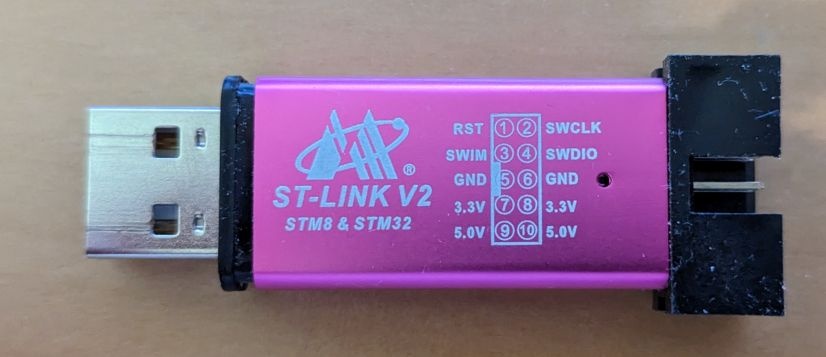
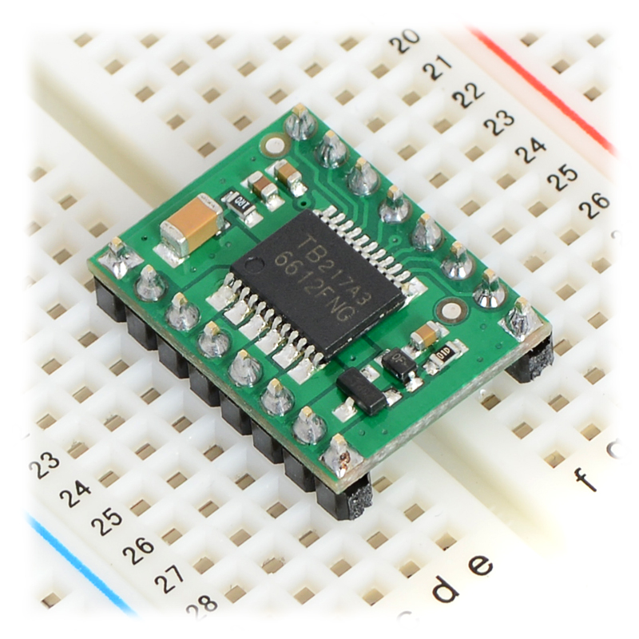
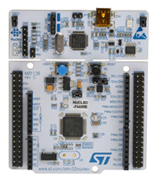

# Bring-Up BOM Gallery

This gallery links product images to the bring-up BOM. Exact images are included only for items with a selected candidate. Items marked `TBD` still need an exact product choice before adding a real product image.

## Current Low-Cost Bring-Up Path

| Item | Candidate | Image | Notes |
| --- | --- | --- | --- |
| STM32 development board | STM32F103C8T6 Blue Pill-compatible development board | TBD | Current low-cost target; add the exact product image after a vendor listing is selected |
| STM32 programmer/debugger | ST-LINK/V2 compatible USB dongle |  | Lower-cost option; verify SWD pinout, target voltage, and driver compatibility before use |
| Dual low-power DC motor driver | Pololu TB6612FNG carrier |  | Low-power bench validation only |

## Deferred Alternate

| Item | Candidate | Image | Notes |
| --- | --- | --- | --- |
| STM32 development board | NUCLEO-F446RE |  | Higher-cost fallback with lower bring-up risk because many Nucleo boards include onboard ST-LINK |

## Items Still Needing Exact Product Images

- STM32F103C8T6 Blue Pill-compatible development board
- Small DC gear motor with encoder
- IMU breakout, because SparkFun ICM-20948 Qwiic was marked out of stock during review
- Current-limited bench power supply
- Digital multimeter
- Jumper wire kit
- Breadboard or terminal block
- USB data cable set
- Anti-static bag or mat
- USB logic analyzer
- Labels or tape
- Quick Start card prototype
